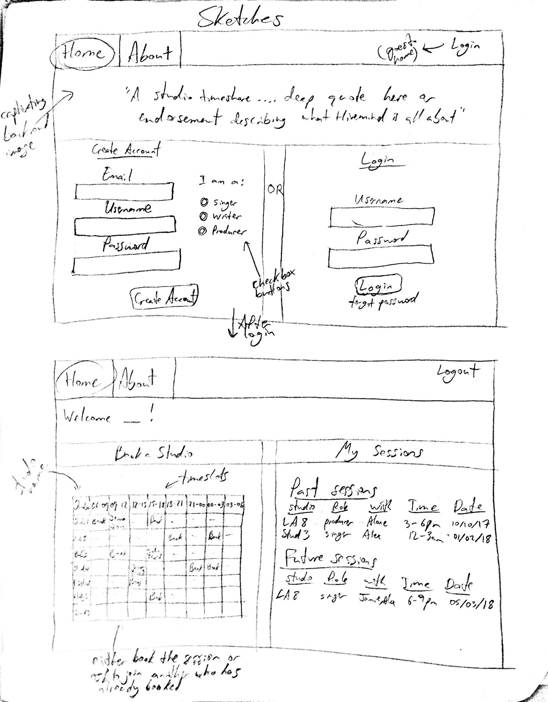
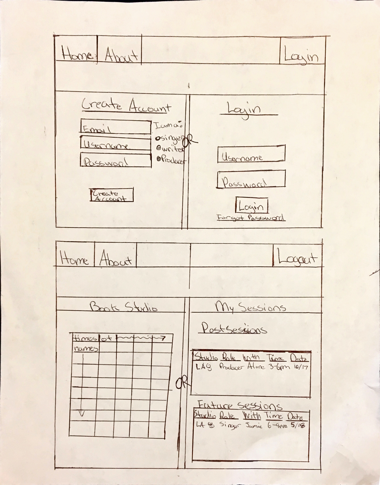

# Project 4 - Design & Plan

Your Team Name: Red Cheetah

## Milestone 1, Part II: Client Selection

### Client Description

[Tell us about your client. Who is your client? What kind of website do they want? What are their key goals?]

Our client is a small publishing company called Hivemind in Los Angeles. An employee there (a coworker of one of our team member's contacts in LA) had an idea to create a website coordinating studios in LA for the company (like a timeshare for studio space). The website would require for us to store studios, their available times in blocks and allow singers, song writers and producers to book sessions. This could get infinitely complicated with various account types being created and restrictions set by users, but ours will most likely just tackle the core mission to organize studios and allow artists to book sessions on an aesthetic website.

[NOTE: If you are redesigning an existing website, give us the current URL and some screenshots of the current site. Tell us how you plan to update the site in a significant way that meets the final project requirements.]

## Milestone 1, Part III: Client Requirements

### Target Audience(s)

[Tell us about the potential audience for this website. How, when, and where would they interact with the website? Get as much detail as possible from the client to help you find representative users.]

The potential audience for this website entails song-writers, artists, and producers in the North Hollywood region of LA. They would interact with the website whenever they were scheduling studio time with their peers or coordinating costs of studio fees. This website would allow them to book time-slots with groups of coworkers or even strangers to create music together.

### Purpose & Content

[Tell us the purpose of the website and what it is all about.]

The purpose of this website would be to solve a big problem in the music industry today of expensive studio renting prices, despite the presence of hundreds of empty private studios taking up space in LA offices. The website will allow studio owners to add studios and open up timeslots for artists to rent. This gives artists the flexibility of an affordable recording space all to themselves and allows studio owners to make a little extra money on the side.

### Needs and Wants

[Collect your client's and target audience's needs and wants for the website. Come up with several appropriate design ideas on how those needs may be met. In the **Memo** field, justify your ideas and add any additional comments you have. There is no specific number of needs required for this, but you need enough to do the job.]

* Needs/Wants
  * **Needs and Wants** (What does your client and audience need and want?)
    * Client wants to grant users the ability of creating two types of accounts: "studio owner" and "musician".
    * Client needs a way for studio owners to add new studios into the system.
    * Client wants nine three-hour timeslots throughout the day for booking.
    * Client wants to distinguish between singers, song-writers and producers in booking appointments.
  * **Design Ideas and Choices** (How will you meet those needs and wants?)
    * On the create account page, users will have the option of listing whether or they are a studio owner or a musician and two separate forms will appear.
    * There will be a form to insert new studios if you are logged into the website as a studio owner.
    * We will have a timeslot table with 9 3 hour timeslot intervals for each studio, which will be filled with the names of those scheduling the appointments.
    * On create account page for musicians, the form will take in a radio selector option distinguishing roles of musicians (song-writers/producers/singers).
  * **Memo** (Justify your decisions; additional notes.)
    * Taking care of dividing users up into two groups: musicians or studio owners, upon account creation is a clear way to distinguish between both accounts since they two two totally separate functionalities of the website.
    * Dividing up columns into nine timeslots and creating a unique table for each studio listing with an ID seems to be the best way to go from the onset. As we progress we may find a cleaner method of scheduling timeslots.
    * Selecting which type of musician you qualify as in the beginning upon account creation would be the easiest way to collect this data. The client is unsure of whether or not one individual can be two roles at once, but we will assume for the purposes of this assignment, and individual can only be labeled as one role for the time being (hence the radio button selector).

### Hosting Plan

[What is your plan for hosting your client's website?]

Our client likes the idea of using GoDaddy to connect the domain name and use phpmyadmin to interact with the database once live. In development though, we can use the tools taught in class, and init our sql databases on-load.

### Client's Edits

[Does the client need the ability to edit the site after the end of the semester? If **Yes**, tell us how you site fit your client's need. If **No**, write down N/A.]

N/A

### Information Architecture, Content, and Navigation

[Lay out the plan for how you'll organize the site and which content will go where. Note any content (e.g., text, image) that you need to make/get from the client.]

[Note: As with the Needs and Wants table, there is no specific amount to write here. You simply need enough content to do the job.]

* Content
  * **Main Navigation** (List your site's navigation here.)
    * Home (where prompted to make an account or sign in)
    * Book a studio (studio owners will see "Add a studio instead")
    * My sessions
    * Logout
  * **Sub-Categories** (List any sub-categories of under the main navigation.)
    * We have no sub-categories planned to date
  * **Content** (List all the content corresponding to main navigation and sub-categories.)
    * *Home*: Give the user the option of either signing up or signing in. style this page nicely, and include a beautiful image with a quick description summary of the purpose of the website;
    * *Book a studio*: Here we will display a large table with studio names being the rows and columns being timeslots. Users will be able to see available studio space here and join sessions alone or with others. There will be a selector and a search bar at the top to search for specific studios or categorize them by location etc. Add a studio is what studio owners will see, and it will be a basic form allowing studio owners to input their studio information into the database;
    * *Manage my studios*: Here studio owners will be able to add, remove, and otherwise manage their studios.  This page will only be available for studio owners who have logged in to their accounts.
    * *My sessions*: Here, the user will be able to see all of their session history and with who they joined studio sessions with. It may also list the musical content created in those sessions logged into the database if there is time.;
    * *Logout*: Logs out the current user;

### Interactivity

[What interactive features will your site have? What PHP elements will you include?]

We will use php to submit forms to add a studio and to interact with our database through SQL whenever users join a session. We will also use php's features in inmplementing our search and select bar at the top of the "Book a Studio" page.  

[Much of this is up to you, however, implementing a login system is **required**. Logging in should not be required to view the site, however it must unlock extra functionality, e.g., admin functionality, comment posting, etc.]

Logging in will grant different privileges depending which type of account you have. Logging in as a studio owner will grant the user the privileges of adding their studio into the database. Logging in as a musician will allow users to book studio times. Without logging in users will only be able to access the home page.
[Also, describe how the interactivity connects with the needs of the clients/target audience.]

The site will allow studio owners and musicians to perform various functions.
Both types of users will be able to browse through all of the studios and see what has been booked and what is available.  They will also be able to look through any pictures of the studio space and any descriptions provided by the studio owner.
Studio owners will be able to add and  remove their spaces from the website.  They will also be able to block or reserve various time slots as well as manage all appointments for their studios.
Musicians will be able to sign up for timeslots either by themselves or with other musicians.  

### External Code

[What libraries (e.g. editor.js, jQuery Cookie, Image Sliders, jQuery) are you planning to use for the site? What do you have to do to incorporate those libraries? How much of your own code will satisfy the project requirements?]
Almost the entirety of our project will be our own code, however we may choose to implement jQuery's library for design purposes (ex: if we wish to incorporate an overlay).

### Scale

[How large will the site be (approximate number of pages) and how many hours of work will be required to complete it?]

The site will be roughly five to seven pages. Due to our unfamiliarity with working together as a team, it is difficult to put gauge an accurate number of work hours.  However, we estimate that it will likely take between 20 and 40 hours split between the team to code the website.

## Milestone 1, Part IV: Work Distribution

[Describe how each of your responsibilities will be distributed among your group members.]

[Set internal deadlines. Determine your internal dependencies. Whose task needs to be completed first in order for another person's task to be relevant? Be specific in your task descriptions so that everyone knows what needs to be done and can track the progress effectively. Consider how much time will be needed to review and integrate each other's work. Most of all, make sure that tasks are balanced across the team.]

Each group member will work together to complete the project.  Since the assignment states that each person is supposed to have a hand in every part of the website, we will not assign specific types of work to individual people.  Instead, we will take on tasks on a case by case basis.  Since we don't have a concrete coding plan, sketches, or wireframes it is a bad idea to try and delegate specifics that may later change.

## Milestone 1, Part V: Additional Comments

[If you feel like you haven't fully explained your design choices, or if you want to explain some other functions in your site (such as special design decisions that might not meet the final project requirements), you can use this space to justify your design choices or ask other questions about the project and process.]

## Milestone 2, Part I: PHP Interactivity

[Describe here what you plan to do for your PHP Interactivity requirement.]

## Milestone 2, Part II: Sketches, Navigation & Wireframes

### Sketches

[Insert your sketches here.]

### Navigation

[What will be your top-level pages and your sub-pages for those top-level pages? What will your website's navigational structure?]

[Tip: If you use card sorting for your navigation, show us that work by including a picture!]

Example:
* Products (top-level)
  * Shoes (sub-page)
  * Pants
  * Shirts
* Shopping Cart
* Contact

* Home
* About
* Log in
  * Book Studio
  * My Sessions

### Wireframes

[Insert your wireframes here.]

## Milestone 2, Part III: Evaluate your Design

[Use the GenderMag method to evaluate your wireframes.]

[Pick a persona that you believe will help you address the gender bias within your design.]

I've selected **[Abby/Patricia/Patrick/Tim]** as my persona.

I've selected my persona because... [Tell us why you picked your persona in 1-3 sentences. Your explanation should include why your persona will help you address gender-inclusiveness bugs in your design.]

### Tasks

[You will need to evaluate at least 3 tasks (known as scenarios in the GenderMag literature). List your tasks here. These tasks are the same as the task you learned in INFO/CS 1300.]

[For each task, list the ideal set of actions that you would like your users to take when working towards the task.]

Task 1: [describe your task]

  1. [action 1...]
  2. [action 2...]
  3. ...

Task 2:

Task 3:

### Cognitive Walkthrough

[Perform a cognitive walkthrough using the GenderMag method for all of your Tasks. Use the GenderMag template in the <documents/gendermag-template.md> file.]

#### Task 1 - Cognitive Walkthrough

[copy the GenderMag template here and conduct a cognitive walkthrough to evaluate your design (wireframes).]

[You may need to add additional subgoals and/or actions for each task.]

#### Task 2 - Cognitive Walkthrough

#### Task 3 - Cognitive Walkthrough

### Cognitive Walk-though Results

[Did you discover any issues with your design? What were they? How did you change your design to address the gender-inclusiveness bugs you discovered?]

[Your responses here should be very thorough and thoughtful.]

## Milestone 2, Part IV: Database Plan

### Database Schema

[Describe the structure of your database. You may use words or a picture. A bulleted list is probably the simplest way to do this.]

Table: users
* field 1: id-AI, not null, primary key, int
* field 2: username- not null, text
* field 3: account_type- not null, text
##values are: singer, writer, producer, owner, admin
* field 4: password- not null, text
##this will also have minimum length and password strength restrictions
* field 5: session_id - int
* field 6: timestamp - not null, timestamp

Table: studios
* field 1: id- AI, not null, primary key, int
* field 2: name- not null, text
* field 3: owner_id: not null, int

Table: appointment_day
* field 1: id- AI, not null, primary key, int
* field 2: date- not null, date
##all the timeslots have the same properties, contain appointment ids
* field 3: 0_3-int
* field 4: 3_6
* field 5: 6_9
* field 6: 9_12
* field 7: 12_15
* field 8: 15_18
* field 9: 18_21
* field 10: 21_0
* field 11: studio_id- int, not null

Table: appointment
* field 1: id- AI, not null, primary key, int
* field 2: musician_1-user_id
* field 3: musician_2-
* field 4: musician_3-
* field 5: musician_4-
* field 6: musician_5-
* field 7: musician_6-

### Database Queries

add account-insert into users (username, account_type, password) values()
log in-select * from users where user = user
add studios- insert into studios (name, owner_id) values()
make appointment-insert into appointment_day (), insert into appointment ()
add people to appointment- update appointment set musician_x to () where id = id
remove people from appointment- update appointment set musician_x to __ where id=id
remove appointment-either delete * from appointment_day where id=id or  delete * from appointment where id=id
##depending on the context, either deletes the day or the appointment itself
remove studio delete * from studios where id = id

## Milestone 2, Part V: Structure and Pseudocode

### Structure

[List the PHP files you will have. You will probably want to do this with a bulleted list.]

* index.php - main page.
* includes/init.php - stuff that useful for every web page.
*

### Pseudocode

[For each PHP file, plan out your pseudocode. You probably want a subheading for each file.]

* *Home*:
sign up: html form-user pass email user type-POST
call query to add user if info checks out
sign in: exact same process as in project 3
* *Book a studio*:
display all available slots in table using sql;
use modified find methods from p2;
if(owner){
  add studio as below;
  redundancy makes it easier for people to find what they want
}
* *Manage my studios*: if(owner){
  add:call query to add a studio
  remove: call query to remove a studio
  block off timeslot: call query to add appointment, adding dummy appointment
  unblock slot: remove dummy query from slot
  add appointment: call query to add appointment with specific users
}
* *My sessions*: select * from appointments where musician_x = id then display in table
* *Logout*: same as in last project

## Milestone 2, Part VI: Additional Comments

[Add any additional comments you have here.]

## Milestone 3: Updates

[If you make any changes to your plan or design, make a list of the changes here.]

## Milestone 4: Updates

[If you make any changes to your plan or design based on your peers' feedback, make a list of the changes here.]

## Milestone 5: Cognitive Walkthrough

[Copy your tasks here from Milestone 2. Update them if you need to and then conduct another cognitive walkthrough.]

#### Task 1 - Cognitive Walkthrough

**Task name: [Create a new user account as a musician and a producer]**

**Action # [1] : [Click 'create account' button at the login page]**

  - Will [Tim] know what to do at this step?
    - Yes, maybe or no: [yes]
    - Why? The website's index.php page automatically lands the user on the login page.
    If somehow Tim gets lost, there is only one other page to go to (create account page)
    and only two buttons in the nav bar with contrasting colors to the background pointing
    him to both those pages.

  - If [Tim] does the right thing, will she know that he did the right thing, and is making progress towards his goal?
    - Yes, maybe or no: [yes]
    - Why? Upon Tim logging in successfully, he will be directed to the home page with the booking
    scheduler table immediately. Also printed at the top of the page will be the words:
    "Welcome Tim!".

**Action # [2] : [Fill in all information fields and press "create account" button]**

  - Will [Tim] know what to do at this step?
    - Yes, maybe or no: [yes]
    - Why? Tim has lots of experience in using different software, he knows that on most websites
    there is located a 'create account' page, and a sign in page. Both of these tabs are clearly and
    obviously placed in contrasting colors on the top right corner nav bar upon login to direct the
    viewer to the only buttons on the screen. It will therefore easy for him to find the right place
    to create his account.

  - If [Tim] does the right thing, will she know that he did the right thing, and is making progress towards his goal?
    - Yes, maybe or no: [yes]
    - Why?  After pressing this button, Tim will directly enter the standard information necessary
    in creating an account, fit with his expectation.

**Action # [3] : [Re-log in the new account]**

  - Will [Tim] know what to do at this step?
    - Yes, maybe or no: [maybe]
    - Why?  After uploading all the information filled before, the page will jumped to the login homepage automatically to ask Tim login again. Tim only need to fill in the username and password in this step. However, currently many software could automatically login the user into new created account so Tim could be confused here (although outside the scope of this class).

  - If [Tim] does the right thing, will he know that he did the right thing, and is making progress towards his goal?
    - Yes, maybe or no: [yes]
    - Why?  Upon Tim logging in successfully, he will be directed to the home page with the sessions
    scheduler table immediately. Also printed at the top of the page will be the words:
    "Welcome Tim!".

#### Task 2 - Cognitive Walkthrough

**Task name: [As a user, book a new time slot and check all booked slots]**

**Action # [1] : [log into the account at the home page]**

  - Will [Tim] know what to do at this step?
    - Yes, maybe or no: [yes]
    - Why? The login page is the very beginning index page of our system, so every user need to login first to do any further operations.

  - If [Tim] does the right thing, will he know that he did the right thing, and is making progress towards his goal?
    - Yes, maybe or no: [yes]
    - Why? There will be a reminder pop out to denote whether the login step is success or not. Also,
    if the login is successful, he will be directed to the main booking page immediately, where
    "Hi Tim!" will be echoed out at the top of the page (for this very reason).

**Action # [2] : [choose a time slot for a certain studio]**

  - Will [Tim] know what to do at this step?
    - Yes, maybe or no: [yes]
    - Why? After logging in, it will automatically jump to the 'book a studio' page. There will be a time table in the middle, each cell of the table contains a few buttons of 'singer', 'writer', or 'producer'. By pressing any button in the table, user could choose to practice in the studio at the chosen time slot as a certain role. The time table is easy to understand, especially when Tim is used to try different kinds of software. The roles in the table are all clickable and resemble links.

  - If [Tim] does the right thing, will he know that he did the right thing, and is making progress towards his goal?
    - Yes, maybe or no: [yes]
    - Why? This will direct him to a page where he can confirm his booking. Afterwards, he will be directed
    to the "My Sessions" page and the session he booked will now appear under his sessions page. There are
    only two tabs for him to keep track of (plus logout) in the nav bar and "My Sessions" is one of them.

**Action # [3] : [press 'my sessions' button to check all records]**

  - Will [Tim] know what to do at this step?
    - Yes, maybe or no: [maybe]
    - Why? This is something we fixed after answering this task's question. After booking a session,
    Tim is now directed directly to the "My Sessions" page where he can view the booking he just made.
    With regards to knowing to click on that tab in the nav bar, there are only two tabs on the left
    isolated from logout (on the right of the nav bar) for this reason. The names are clearly labeled
    and text color contrasts will with nav bar color.

  - If [Tim] does the right thing, will he know that he did the right thing, and is making progress towards his goal?
    - Yes, maybe or no: [yes]
    - Why? The "My Sessions" page will list all booking records in chronological order and it will clearly separate all results into 'past sessions' and 'future sessions', Tim could get the result very quickly.

#### Task 3 - Cognitive Walkthrough

**Task name: [As a manager, add a new studio]**

**Action # [1] : [log into the manager account at the home page]**

  - Will [Tim] know what to do at this step?
    - Yes, maybe or no: [yes]
    - Why? We designed the system as any user should login in the first place. This way the manager
    doesn't need to remember anything else on top of simply logging in with his username and password.
    ("manager" and "password0" as of now)

  - If [Tim] does the right thing, will he know that he did the right thing, and is making progress towards his goal?
    - Yes, maybe or no: [yes]
    - Why? After logging in as a manager, user directly enters the homepage of manager and there is
    nowhere else to go. There will also be echoed out a greeting message saying "Hi manager!"

**Action # [2] : [add the information of the new studio at the home page of manager]**

  - Will [Tim] know what to do at this step?
    - Yes, maybe or no: [yes]
    - Why? The nav bar has no other pages to go to besides the logout button. Also,
    on the manager page there is only one button to add a studio with a textbox for studio name.
    The functionality on this page is perhaps the simplest in the entire website.

  - If [Tim] does the right thing, will he know that he did the right thing, and is making progress towards his goal?
    - Yes, maybe or no: [yes]
    - Why? Right after adding a studio, the new studio name will appear in a list directly above
    the textbox and button. He will see his studio listed there! This page is designed for a small
    number of studios as of now, as per the client's request.

**Action # [3] : [press 'add studio' button to finish adding]**

  - Will [Tim] know what to do at this step?
    - Yes, maybe or no: [yes]
    - Why? The button is easy to see and right next to the input form. It's also
    the only button on the page.

  - If [Tim] does the right thing, will he know that he did the right thing, and is making progress towards her goal?
    - Yes, maybe or no: [yes]
    - Why? After pressing the button, the studio will appear right above the text box.

#### Task 4 - Cognitive Walkthrough

**Task name: [As a user, check who is going to practice with you in a certain time slot you booked]**

**Action # [1] : [log into the account at the home page]**

  - Will [Tim] know what to do at this step?
    - Yes, maybe or no: [yes]
    - Why? The login page is the very beginning index page of our system, so every user needs to login first to do any further operations. We have outlined above already the simplicity of this step

  - If [Tim] does the right thing, will he know that he did the right thing, and is making progress towards his goal?
    - Yes, maybe or no: [yes]
    - Why? There will be a reminder pop out to denote whether the login step is success or not, and
    his name will be echoed on the top of the page upon success as a welcome message.

**Action # [2] : [Press 'my sessions' button to see all records]**

  - Will [Tim] know what to do at this step?
    - Yes, maybe or no: [yes]
    - Why? After logging in, it will automatically jump into the personal homepage. The target button is almost at the middle of the navigation bar and the font-size of the letters are quite large,
    The colors of the text and nav bar are also contrasting. Tim will be able to easily find the button.

  - If [Tim] does the right thing, will he know that he did the right thing, and is making progress towards his goal?
    - Yes, maybe or no: [yes]
    - Why? The page is clearly split into "past sessions" and "future sessions". This is a clear
    indicator to the user he is on the sessions page.

**Action # [3] : [Find the certain record and all the related information through this page]**

  - Will [Tim] know what to do at this step?
    - Yes, maybe or no: [yes]
    - Why?  In this page, Tim will directly see all records. Under each record, he will see the time, the name of studio, other users booking the same timeslot, the roles of the partners. Tim will know the message he wants to know will be find in this page. Also since the records will be separated into two parts, finding the timeslot will be easier. They are also ordered chronologically, making sifting or
    scrolling through to find the right session easy.

  - If [Tim] does the right thing, will he know that he did the right thing, and is making progress towards his goal?
    - Yes, maybe or no: [yes]
    - Why? The page includes all the information Tim wants to know, and once he finds the correct
    session line, the string is parsed with many functions to clearly say in plain English who
    that session is booked with. If no one else is in the session, "alone" is echoed out in place.

### Cognitive Walk-though Results

[Did you discover any issues with your design? What were they? How did you change your design to address the gender-inclusiveness bugs you discovered?]

[Your responses here should be very thorough and thoughtful.]

We made several minor changes in this process. We redirected where pages went and which
messages were displayed in which order. For example, we realized that after booking a session
it would make more sense for the user to be directed to the "my sessions" page in place of
the home page. We also made small stylistic changes to further contrast nav bar button colors
and wrote php code to make unnecessary nav bar items disappear when the manager logs in to
avoid confusion. We also echo out a variable in the text of the login/logout button now
and added a nav bar to the login page, whereas before completing the entire design-plan we
did not include a nav bar on our index.php page. With regards to gender-inclusivity, we
decided afterwards that some of our site's images needed to be changed since they were
too heavy in appearance. We chose a very rich picture for the home page, and lighter images
once logged in for this reason.

## Milestone 5: Final Notes to the Clients

[Describe in some detail what the client will do (or would have to do) in order to make this website go live. What is the deployment plan?]

[Include any other information that your client needs to know about your final website design. For example, what client wants or needs were unable to be realized in your final product? Why were you unable to meet those wants/needs?]

A few of us will continue to further assist the client in deploying the website. We are thinking of
using GoDaddy with phpMyAdmin. This is a very interesting project we wish to see through.

## Milestone 5: Final Notes to the Graders

[1. Give us three specific strengths of your site that sets it apart from the previous website of the client (if applicable) and/or from other websites. Think of this as your chance to argue for the things you did really well.]

1. Our site uses live LA time and is fully interactive. You will notice, that the first column in
the booking sessions table contains the current time in Los Angelos, and the entire table will shift
one column over every three hours. Under "my sessions", bookings in future sessions will become past
sessions the second that particular session actually begins (assuming the page is refreshed).
2. Our site lets each user register as one or multiple roles (singer/writer/producer),
resulting in a more tailored user account, and satisfying the need of our client and users.
This made the back end a challenge, as we check for overlaps in each cell in each timeslot,
and maximize talent in each session by only allowing one individual of each role to book together.
The website may appear simple, but lots of back end coding went in to making this functionality
possible.
3. The parsing in our code is very complex. We store timevalues in the database as strings,
then parse them to display the time in the table column heading in the 00:00:00 format, then
again when displaying information on the "my sessions" page, we parse together a coherent string
from all our variables to display the session you booked. For example, a future booked session may
display: "studio1 alone (or with userx and usery) as a writer from 9am to noon on 2018-05-16".

[2. Tell us about things that don't work, what you wanted to implement, or what you would do if you keep working with the client in the future. Give justifications.]

1. We may allow manager delete their studio if they are closing their on-going studio.
2. We may allow musicians cancel their future timeslots.
3. We could also give the manager access to view all sessions in a stylish format, or even
create an entirely new type of user for studio owners themselves to book a session. This would
further complicate the network, but would be necessary once our client's start up has a thriving
network on this platform first.

[3. Tell us anything else you need us to know for when we're looking at the project.]
